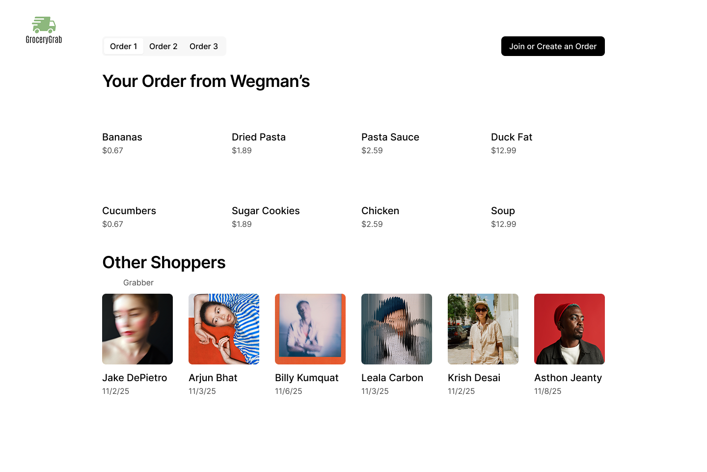
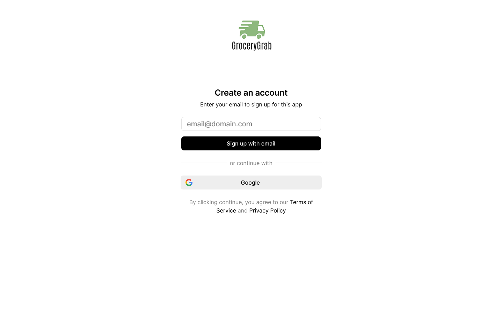
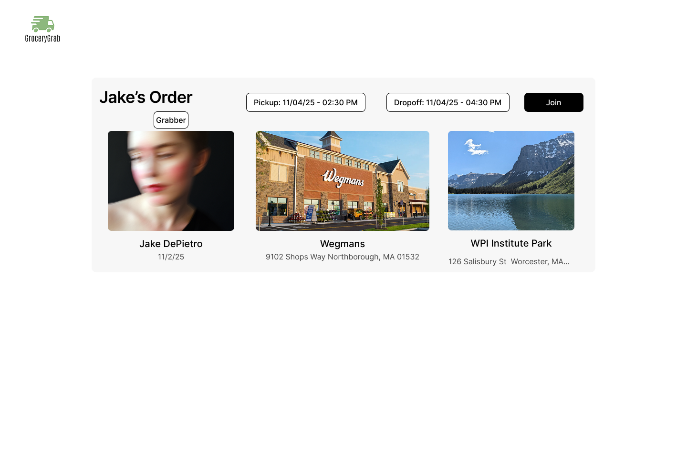
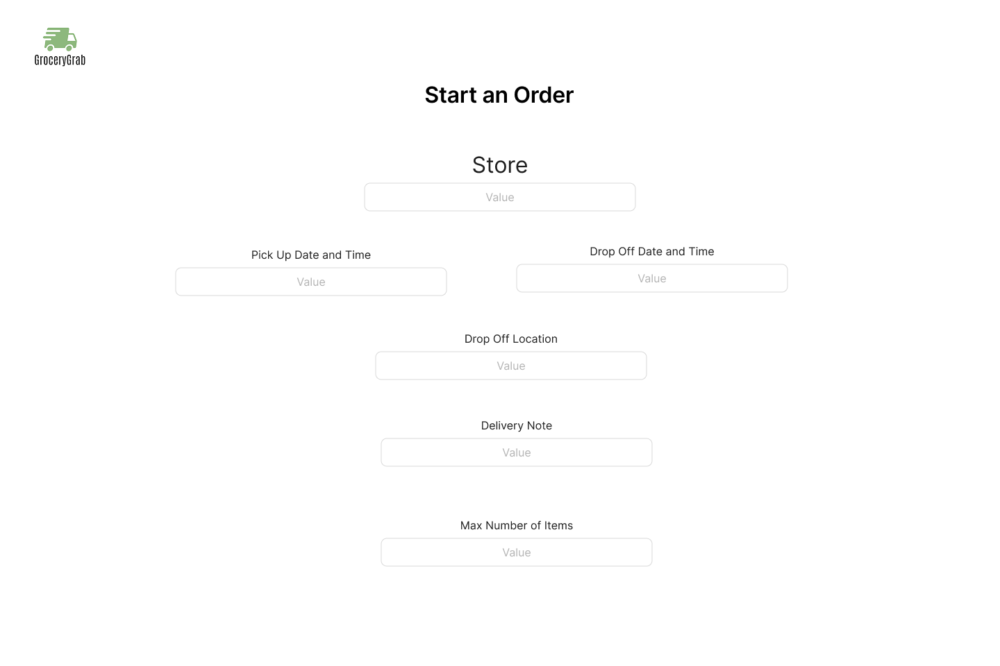
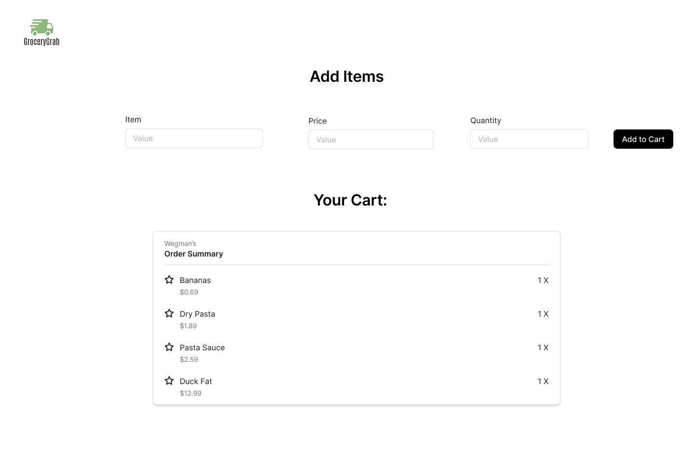

# Software Requirements and Use Cases

## Your Project Title
--------
Prepared by:

* `Leala Carbonneau`,`Worcester Polytechnic Institute`
* `Arjun Bhat`,`Worcester Polytechnic Institute`
* `Jake DePietro`,`Worcester Polytechnic Institute`
* `Raghavan Rajkumar`,`Worcester Polytechnic Institute`

---

**Course** : CS 3733 - Software Engineering

**Instructor**: Sakire Arslan Ay

---

## Table of Contents
- [1. Introduction](#1-introduction)
- [2. Requirements Specification](#2-requirements-specification)
  - [2.1 Customer, Users, and Stakeholders](#21-customer-users-and-stakeholders)
  - [2.2 User Stories](#22-user-stories)
  - [2.3 Use Cases](#23-use-cases)
- [3. User Interface](#3-user-interface)
- [4. Product Backlog](#4-product-backlog)
- [4. References](#4-references)
- [Appendix: Grading Rubric](#appendix-grading-rubric)

## Document Revision History

| Name | Date | Changes | Version |
| ------ | ------ | --------- | --------- |
| Revision 1 |2025-11-07 |Initial draft | 1.0        |
| Revision 2 |2025-11-02 |Intro and Requirements | 2.0        |
| Revision 3 |2025-11-03 | 2.1, 2.2 and 2.3 | 3.0        |
| Revision 4 |2025-11-05 | 3, 4, 5 | 4.0        |

----
# 1. Introduction

Provide a short description of the software being specified. Describe its purpose, including relevant benefits, objectives, and goals.

The software will be a way to group order and retrieve groceries. It will be similar to Uber Eats but users in a similar location can all order together and one individual will agree to pick up the order. This can be used for apartment buildings and roommates. One person will start an order at a certain location. Other users can add-on to an order. The individual that started the order will then grab the group order when the designated time comes. Individuals who order should be able to pick up their groceries in one convenient location, once it's dropped off. This will streamline the grocery shopping process, save money and energy, and allow individuals to save money on delivery costs from other software.

----
# 2. Requirements Specification

This section specifies the software product's requirements. Specify all of the software requirements to a level of detail sufficient to enable designers to design a software system to satisfy those requirements, and to enable testers to test that the software system satisfies those requirements.

- Need a user login function, where users can create an email associated with our website
- users are able to create, join or manage a group grocery orders
- Users can add, edit, or remove items before the order deadline.
- The system calculates costs and processes secure payments.
-One user is designated to pick up and deliver the group order.
- Users recieve updates on status of there order
- Users will select a designated spot for pickup and a location for where the grocceries are being picked up.

## 2.1 Customer, Users, and Stakeholders

A brief description of the customer, stakeholders, and users of your software.

Customers: The main customers are individuals who are looking to have a more efficient way to get groceries as a group

Stakeholders: This includes the development team (us) and the user and the grocery stores, and independent investors

Users: The people who are in similar locations who are looking to have a easier way in getting groceries as a collective

----
## 2.2 User Stories
This section will include the user stories you identified for your project. Make sure to write your user stories in the form : 
"As a **[Role]**, I want **[Feature]** so that **[Reason/Benefit]** "

1. User story 1

  As a user, I want to create and manage a group grocery order so that others nearby can add their items and share the cost

2. User story 2

  As a user, I want to join an existing group order so that I can reduce trips to the store

3. User story 3

  As a user picking up an order, I want to receive a combined shopping list so that I can efficiently collect everyone’s groceries

4. User story 4

  As a user, I want to receive notifications about order updates and deadlines so that I don’t miss my chance to receive items

5. User story 5

  As a user, I want to securely pay for only my selected groceries so that costs are fairly divided among all participants using paypal.

6. User story 6

  As a user picking up an order, I want to mark when I’ve picked up or delivered groceries so that participants know the current order status

7. User story 7

  As a user, I want to have an secure login on the website, so that I can safely order the groceries I want

8. User story 8

  As a user picking up an order, I want to have a set pick up time, so that I can schedule and plan ahead for the pickup

9. User story 9

  As a user, I want to receive an estimated total before finalizing my items so that I know how much I’ll be charged.

10. User story 10

  As a user, I want to receive confirmation once my items are delivered so that I know my groceries are ready for pickup

11. User story 11

  As Admin, I want to be view, edit and delete every item so that any problems in the pickup process can be addressed

12. User story 12

  As user, I want to be able to only view what i have ordered so that I can ensure my privacy

----
## 2.3 Use Cases

This section will include the specification for your project in the form of use cases. 

Group the related user stories and provide a use case for each user story group. You don't need to draw the use-case diagram for the use cases; you will only provide the textual descriptions.  **Also, you don't need to include the use cases for "registration" and "login" use cases for both student and faculty users.**

  * First, provide a short description of the actors involved (e.g., regular user, administrator, etc.) and then follow with a list of the use cases.
  * Then, for each use case, include the following:

    * Name,
    * Participating actors,
    * Entry condition(s) (in what system state is this use case applicable),
    * Exit condition(s) (what is the system state after the use case is done),
    * Flow of events (how will the user interact with the system; list the user actions and the system responses to those),
    * Alternative flow of events (what are the exceptional cases in the flow of events and they will be handles)
    * Iteration # (which sprint do you plan to work on this use case) 

Each use case should also have a field called "Iteration" where you specify in which iteration you plan to implement this feature.

You may use the following table template for your use cases. Copy-paste this table for each use case you will include in your document.

| Use case # 1      |   |
| ------------------ |--|
| Name              | Creating and joining a group order  |
| Participating actor  | User  |
| Entry condition(s)     | The user is logged into the system  |
| Exit condition(s)           | A new group order is created or the user sucesfully joins an existing one.  |
| Flow of events    | 1. User selects create order or join order    2. User selcts tha grocery store and sets the order time   3. Other users in the same area can join the order potentially   4. System acknowledges that the order is created or if the user has sucessfully join the order |
| Alternative flow of events  | 1. If a order is closed or full, then the system will notify the user.   2. In step 1, if there are no orders happening, then the system will notify the user or help the user create an order    3. In step 2, if the user decides they don't want to do the order anymore, they can click a cancel button, which will help the user escape to the home page and notify the system, that this order is no longer happening.  |
| Iteration #         | 1 |

| Use case # 2      |   |
| ------------------ |--|
| Name              | Manage Pickup and Delivery  |
| Participating actor  | Pickup User  |
| Entry condition(s)     | The group order has been finalized and the initial user is ready to pickup |
| Exit condition(s)           | Groceries are picked up and marked as delivered. |
| Flow of events | 1. Pickup user views the combined shopping list.   2. Pickup user travels to the store and collects all items.   3. Pickup user sets or confirms the pickup time and delivery location   4. System updates the order status to “Picked Up” or “Delivered.” |
| Alternative flow of events | 1. If the pickup user cannot complete the pickup, they can reassign the role    2. If a pickup user needs to change the delivery location or time, they can update it in the app and notify the group order users    3. If a product was not available at the time, the pickup user can notify the user that ordered it  |
| Iteration #         | 2 |

| Use case # 3      |   |
| ------------------ |--|
| Name              | Process Payment and Display Cost Estimate  |
| Participating actor  | User  |
| Entry condition(s)     | The user has added items to an order and is ready to checkout. |
| Exit condition(s)           | Payment is successfully processed and the user receives confirmation. |
| Flow of events | 1. User reviews their selected items and estimated total.    2. System displays the calculated cost for the user’s portion.    3. User proceeds to checkout using PayPal.    4. System confirms payment and updates the group order total. |
| Alternative flow of events    | 1. If the payment fails, the user receives an error message and may retry or select another payment method.    2. If an item needs to be added or deleted from the cart, the user may do so  |
| Iteration #         | 2 |

| Use case # 4      |   |
| ------------------ |--|
| Name              | Send Notifications and Delivery Confirmations  |
| Participating actor  | User  |
| Entry condition(s)     | The user is part of an active group order. |
| Exit condition(s)           | The user receives all relevant notifications and confirms receipt of groceries. |
| Flow of events | 1. System sends notifications for approaching deadlines, pickups, and deliveries.    2. User receives alerts via web or mobile.   3. After delivery, system sends a confirmation message.   4. User confirms receipt of groceries. |
| Alternative flow of events   | 1. If a notification fails to send, the system retries or displays the alert in the user’s dashboard.   2. If the user fails to confirm receiving groceries, reminder notifications are sent  |
| Iteration #         | 3 |

| Use case # 5      |   |
| ------------------ |--|
| Name              | Admin Management of Orders and Items  |
| Participating actor  | Admin  |
| Entry condition(s)     | The admin is logged into the system dashboard. |
| Exit condition(s)           | Admin has viewed, edited, or deleted order items as needed. |
| Flow of events | 1. Admin selects an order to review.   2. Admin edits or deletes incorrect items.   3. System updates the order and logs admin actions. |
| Alternative flow of events    | 1. If the admin tries to edit a finalized order, the system restricts changes and prompts for confirmation.   2. If the admin edits an order, a notification is sent to the user with edit description and reasoning.  |
| Iteration #         | 3 |

| Use case # 6      |   |
| ------------------ |--|
| Name              | View Personal Orders Only  |
| Participating actor  | User  |
| Entry condition(s)     | The user is logged in and part of a group order. |
| Exit condition(s)           | User views only their own order items and details. |
| Flow of events | 1. User accesses “My Orders” page.   2. User can access a description of their current selected items, stores, drop off location and times   3. System filters and displays only the user’s selected items and payment details. |
| Alternative flow of events    | 1. If a user attempts to access another’s order data, the system denies access and shows an error message.  |
| Iteration #         | 3 |

----
# 3. User Interface

Here you should include the sketches or mockups for the main parts of the interface.
You may use Figma to design your interface:
  <kbd>
      
  </kbd>

  <kbd>
      
  </kbd>

  <kbd>
      
  </kbd>

  <kbd>
      
  </kbd>

  <kbd>
      
  </kbd>

  <kbd>
      
  </kbd>
  
----
# 4. Product Backlog

Here you should include a link to your GitHub repo issues page, i.e., your product backlog. Make sure to create an issue for each user story.  

https://github.com/Ghav811/CS3733-Group-Project/issues

----
# 5. References

Cite your references here.

For the papers you cite give the authors, the title of the article, the journal name, journal volume number, date of publication and inclusive page numbers. Giving only the URL for the journal is not appropriate.

For the websites, give the title, author (if applicable) and the website URL.

PayPal Developer Documentation. “Integrate Checkout.” PayPal, 2024. https://developer.paypal.com/docs/checkout/

Nielsen, Jakob. “10 Usability Heuristics for User Interface Design.” Nielsen Norman Group, 2020. https://www.nngroup.com/articles/ten-usability-heuristics/

----
